[TOC]

# 第2章 HTTP协议

## curl 命令

```shell
curl <url> 
```

| param |  function  |
| :---: | :--------: |
|  -I   | 返回头信息 |

## http协议请求

### 请求过程


### 请求方法

```html
GET/POST/HEAD/DELETE/PUT
```

GET：获取页面指定信息。可传送数据但是有长度限制，且发送数据显示在浏览器端

HEAD：与GET功能相同，但是不返回消息主题，常用于扫描

POST：向服务器传送大量数据，且比GET安全

### http响应码

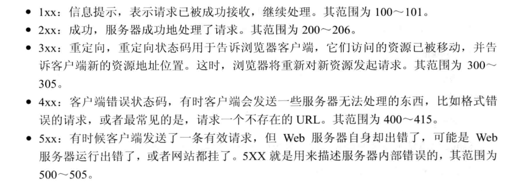


## Burp suite基础功能


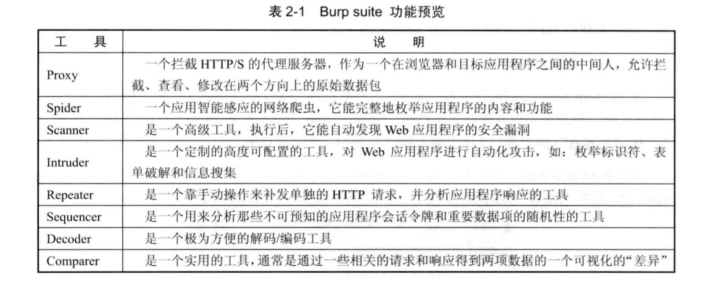

### target

可以对网站的请求进行快速分类分析

### spider

### intruder

- Payload

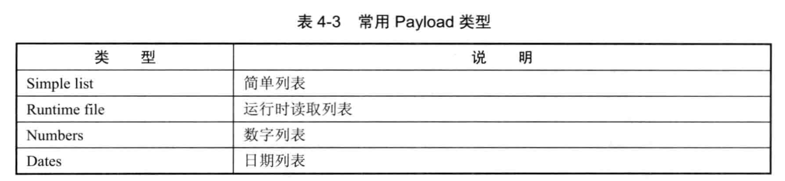

## fiddler

一款http（s）协议分析工具


## Winsock Expert

应用流量分析工具

# 第3章 信息收集

## 谷歌搜索

### 谷歌常用语法

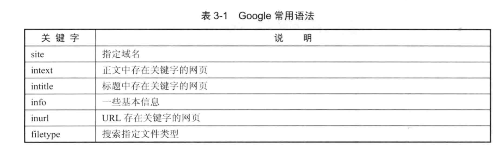

1. 查找含有学号的excel文档：

```
site:domain.com 学号 type：xlsx
```

2. 查找登陆页面：

```
site:domain.com 登陆 filetype:php
```

3. 查找安装应用后在页面中存在特定字符串的网站

   

   intext:Powered by Discuz

## nmap

### nmap常用参数

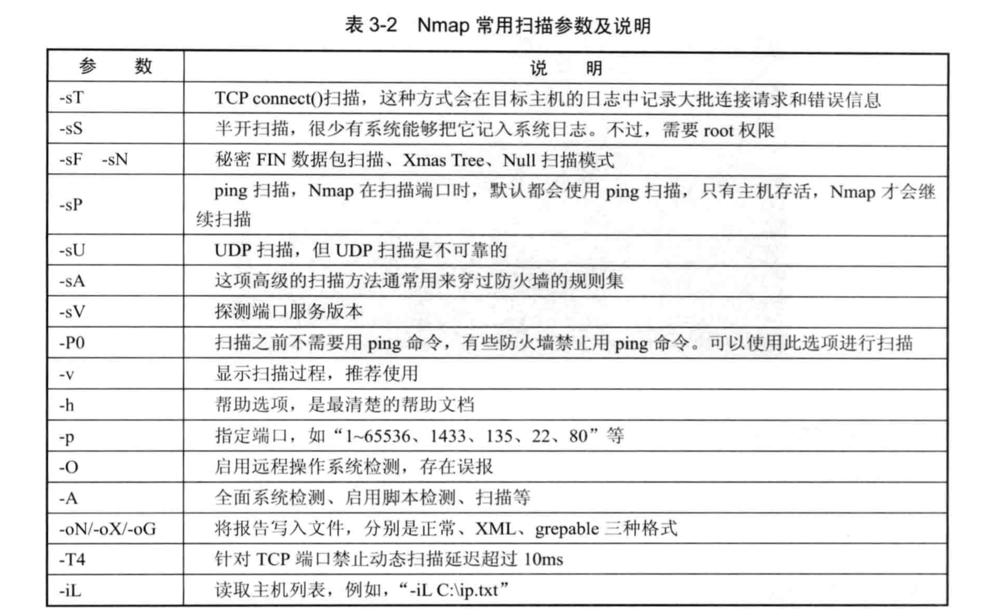

| 参数 |     功能     |
| :--: | :----------: |
|  -O  | 操作系统扫描 |
|  -A  | 全面系统探测 |
|      |              |


## nmap脚本引擎

nmap安装目录下的Script文件夹有多个以**".nse"**后缀的文件，即nmap自带脚本引擎。也支持自己编写Nmap Script

### 语法

- 基本用法

```shell
nmap --script=[模块名称]
例：nmap -p 80 --script=http-enum.nse www.domain.com
```

- 使用全部脚本扫描/http-开头的脚本扫描

```shell
nmap --script [all/"http-"]
```

### 常用脚本文件

|      脚本名       |    功能     |
| :---------------: | :---------: |
| Sql-injection.nse | sql注入检测 |
|                   |             |


# 漏洞

## SQL注入

### 目的

绕过程序限制，将想要运行的语句传入数据库，获取更多信息或更大权限（即获得读、写、执行权限）

- 查询数据
- 读写文件
- 执行命令

### 原理

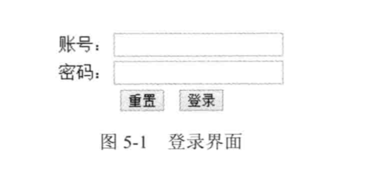

登录时如果输入的内容与数据库中查询到的数据匹配，则登陆成功。查询并匹配的代码如下：

```java
String sql = "select count(*) from admin where username='+"admin.getUsername()+"' and password='"+admin.getPasword()+"'";
```

执行语句后判断结果是否>0，是则登陆成功，否则登陆失败。

提交账号为admin，password时，数据库实际执行的查询语句为

```sql
select count(*) from admin where username='admin' and password='password'
```

如果``admin.getPassword()``函数传入的参数为' or 1=1 --

查询语句就变为

```sql
select count(*) from admin where username='admin' and password='' or 1=1 --'
```

由于where条件中的``1=1``永远为真，该语句与``select count(*) from admin``等价，只要数据库中有数据，必定返回``true``

### sql注入漏洞分类

- 数字型：id=1等
- 字符型：usename='admin'等


**以下环境基于威克cms进行实验**

## mysql

### 重要表格

- information_schema

记录了数据库信息

| table    | content    | useful columns                                               |
| -------- | ---------- | ------------------------------------------------------------ |
| SCHEMATA | 数据库信息 | schema_name                                                  |
| TABLES   | 表格信息   | TABLE_SCHEMA\|TABLE_NAME\|CREATE_OPTIONS                     |
| COLUMNS  | 列信息     | TABLE_SCHEMA\|TABLE_NAME\|COLUMN_NAME\|DATA_TYPE\|PRIVILEGES |

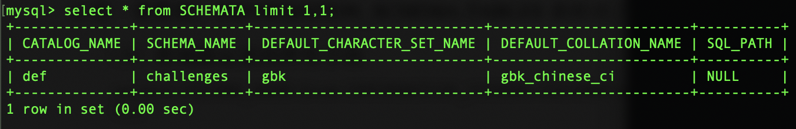

查询当前数据表

```sql
select table_name from information_schema.tables where table_schema=(select database());
```


- mysql

记录用户信息

| table | content  | useful columns         |
| ----- | -------- | ---------------------- |
| user  | 用户信息 | Host\|User\|Password\| |


### 好用的函数

| name                 | function                                                     |
| -------------------- | ------------------------------------------------------------ |
| database()           | 查看当前数据库名称                                           |
| user()               | 查看用户                                                     |
| current_user()       | 查看当前用户名                                               |
| system_user()        | 查看系统用户名                                               |
| load_file()          | 导入文件内容（需提供绝对路径）                               |
| into outfile         | 导出到文件（需提供绝对路径）                                 |
| concat()             | 连接字符串，一次可以查询多列，将值合并到一列，concat(column1,',',column2) |
| concat_ws()          | 连接字符串。可以在第一个参数中声明分隔符，concat_ws(',',column1,column2) |
| @@version_compile_os | 操作系统版本                                                 |
| @@datadir            |                                                              |
| @@basedir            |                                                              |

- load_file()

该函数需要配置secure_file_priv的值。如果没有权限或者没有在指定目录下导入导出，只会返回null   汗- -！

查看配置命令：

```sql
show global variables like '%secure%';
```

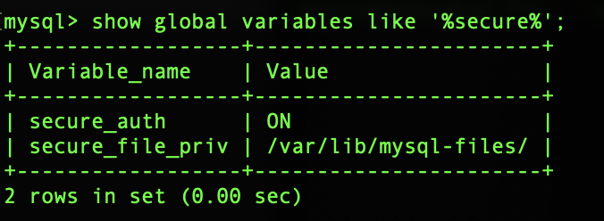

null——不允许导入导出

具体路径——只允许在该路径下进行导入导出操作

无具体值——可以在任意路径下导入导出

- concat()

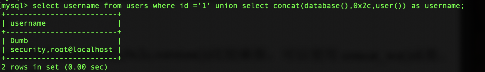


### 利用group by+报错进行列名探测

查询语句：

```sql
select * from users where username=='root' and passwd=='passwd'
```

需要传入``$_USERNAME``和``$_PASSWD``参数。传入``having 1=1 -- ``时，返回错误：

~~这里好像没有找到成功的~~

后期确认：mysql不要去查询的列和group by字段一致，不会存在这种报错，汗- -!SQL Server真的很严格


### 利用order by获取列的数量

原理：当order by一个不存在的列时会报错

```sql
select * from users where id=1 order by [column]
```

``order by``后的column以数字表示，从1开始，一直试到第n次出现报错，则列数就是n-1列


## 显错式注入

与上面从是否报错以判断语句是否正确的方法不一样，显错式注入是将语句执行的结果返回在报错信息里。

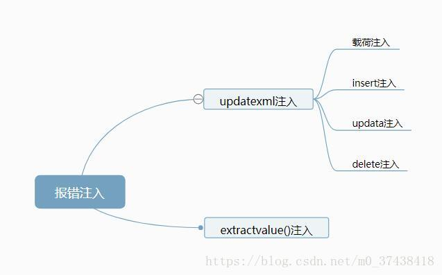

### updatexml()/extractvalue()

``updatexml``函数共有三个参数，``UPDATEXML (XML_document, XPath_string, new_value)``

显错注入主要利用第二个参数XPath_string需要符合xpath格式标准，否则会报错，并且将错误的部分返回回来。

**简单粗暴的理解一下**：xpath有点类似于路径名称，``/usr/home/lookback``这种。那往里面放一些奇奇怪怪的字符，基本上都得报错。

~~至于正确的怎么写就不用深究了，反正错误有一千种姿势，随便学一个就能用辽～~~

举个栗子。往这个函数里面填一些正常的路径，都可以执行：

```sql
select * from users where id=1 and updatexml(1,'usr/lookback',1);
```

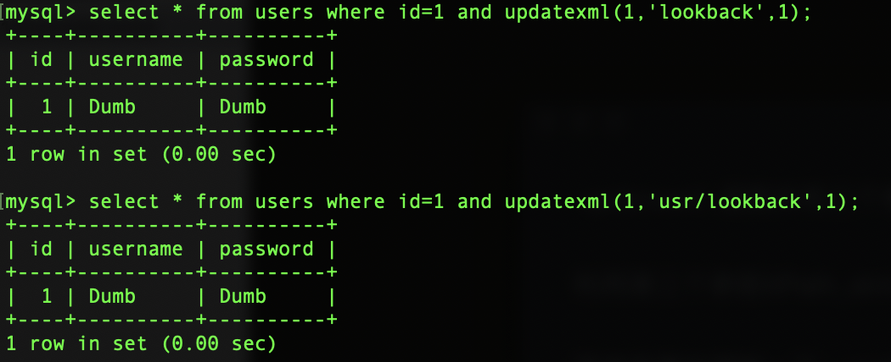

写一个错误的，在路径前后都加上``|``符号

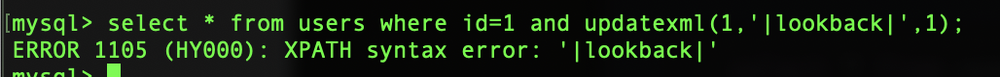

- 这里注意一下不要用``@``、``/``符号，这些是xpath允许出现的符号

利用这个特性，可以在第二个字符串中使用一些函数或语句，只要在前后加上特殊字符就行了

```sql
select * from users where id=1 and updatexml(1,concat(0x7c,(select database()),0x7c),1);
```

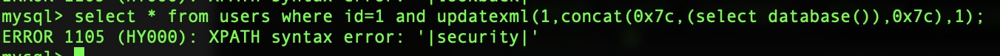

extractvalue函数和updatexml是类似的，``extractvalue (XML_document, XPath_string)``

也是利用xpath的格式要求进行注入。

### floor

floor注入实际上还关系到3个函数：``count()``、``group by``、``rand``

- count和group by

  在count的时候，实际上是新建一个虚拟表，再对group by的key进行遍历，如果key值存在，则count+1，否则新添一行且count为1

- rand

  ~~这个函数没有花很多时间查，只是通过规律进行一个合理的猜测。~~

  ~~查了一些资料，感觉都讲的不怎么透彻啊，叹气~~

  rand函数有两种用法，rand()和rand(N)，rand()是真随机，rand(N)是假随机（个人理解）。rand(N)中的N是个随机种子，在随机种子确定的情况下值也一样。如果用rand()会导致有时报错有时不报。

  执行以下语句，会在``group by``处报错

  ```sql
select count(*),(floor(rand(0)*2))x from users group by x;
  ```
  
  只要修改x的值，加入想执行的命令即可

  ```sql
select count(*),concat_ws(0x7c,database(),(floor(rand(0)*2)))x from users group by x;
  ```
  
  执行后如下

  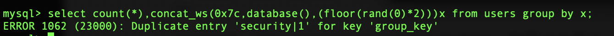


### 空格

mysql在查询的时候会无视掉后面的一串空格

```sql
insert into users(id,username,password) values(15,'Dumb  ','123');
select username from uses where name='Dumb  ';
```

搜索的时候搜``'Dumb   '``会将``Dumb``也作为结果返回

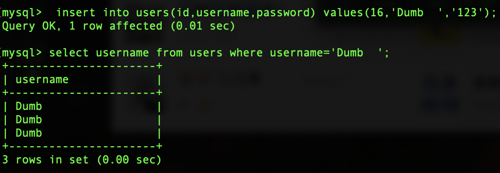

不过这个特性……好像也没啥用 汗 -_-!

## 盲注

这年头还会在把报错信息返回到页面的太少了_(:з」∠)盲注是个比较好的选择

### 延时注入

